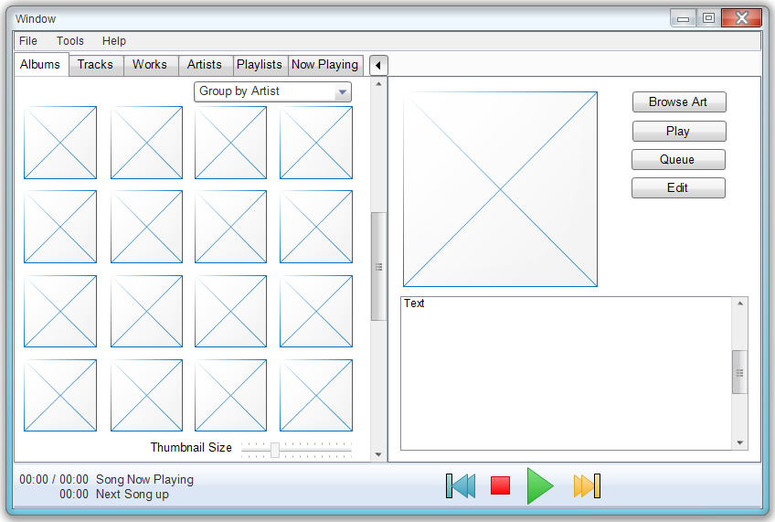

MusicBrainz Player Design
=========================

Why this project
----------------

It all started when I found Musicbrainz and decided to both add to the
Musicbrainz database with information from my collection (if there were gaps)
and to tag my music files to benefit from the rich data model that Musicbrainz
provides. One of the features I really like about Musicbrainz is their support
for a large number of "Cover" art images - with tags to indicate is the
artwork is part of a booklet. That sparked my imagination to dream of bygone
days when I would queue up one of my favorite albums and then sit down to
listen to it while perusing the liner notes. I'm a lover of classical music
and most of the better albums came with a very detailed booklet describing the
works being performed, the performers, the venue and so on. I looked and looked
and nothing I found came close to supporting that experience. So I decided to
write it myself.

Vision
------

The main goal of this project is to create a Musicbrainz centric music player
that has features that support the following "feel" (some of the younger folks
reading this might have a hard time relating):

    Picture yourself with your physical music collection in a room with a
    good stereo system. You carefully select the album you want to listen
    to; put it on the phonograph player, turn it on and carefully place
    the needle on.  Then you take the album cover and liner and sit down
    in the perfect spot and start intensely listening to the music. Drink
    it in; revel in it, immerse yourself in it. As you listen, you take
    out the liner notes - a nice thick book full of background information
    on the composer, the performers, the nature of the work, and so on.
    You listen and drink in the music and information about the music.
    Bliss.

Now translate that experience to the modern age. With the rich database of
Musicbrainz and their extensive links to background information, cover art,
works, artists, recordings, etc.  You have tools to help you locate just the
music you want. You can examine the liner notes, examine the covers, filter
your collection in a variety of ways. Then, once you've selected the music you
want; you queue it up and start listening. But now you can peruse the
information about the music being played. You can read the liner notes, look at
the front and back covers. But you can also browse through all the data
associated with each track - read about the artists, look at a picture of the
place where the recording was made, find other performances of the same work.

Definitions of Terms
--------------------

.. glossary::

    **Album**
        An album is one or more discs each containing one or more tracks. This
        collection is published as an atomic unit and includes artwork on the
        cover and in inserted materials in the form of booklets, liner notes, and
        posters.

    **Disc**
        A physical piece of media that is always part of an album, and which
        contains a set of tracks in a particular order. The discs themselves within
        their containing album are also ordered. A disc never exists outside of an
        album.

    **Track**
        An individual atomic recording captured on media. It is often digitized
        into a single file where metadata can be embedded together with the encoded
        audio. Tracks can stand alone, or might be part of a playlist, or disc.

    **Playlist**
        A collection of tracks, discs, albums, and other playlists. At its root it
        is an ordered set of tracks where those tracks may be held in various
        subordinate containers. A playlist may also contain artwork and additional
        metadata. What distinguishes it from an album is that does not represent
        something published. Rather, it represents custom assemblies of music the
        user might make and share with others.

    **Central Repository**
        This refers to the central MusicBrainz database and associated services
        (mostly for artwork. It has information about more tracks and albums than
        anyone could ever collect; being that it is the union of the collections of
        all those who work with it.

    **Local Repository**
        A subset of the Central Repository holding data about those tracks and
        albums that the local user has in all their Music Libraries. It also has
        information that links the data in the repository to the physical media in
        those Music Libraries. In addition, it is responsible for understanding how
        the local repository has changed relative to the Central Repository.

    **Music Library**
        A collection of media files organized in a particular hierarchical
        structure. Initially this is simply the directory of the root of a
        collection of directories containing music files. However, any filesystem
        like interface can be used so long as the program has some means to browse,
        read, and optionally modify any of the files within it.

Key MBPlayer Concepts
---------------------

Central repository, local repository, and synchronization
~~~~~~~~~~~~~~~~~~~~~~~~~~~~~~~~~~~~~~~~~~~~~~~~~~~~~~~~~

This idea was largely influenced the a movie collection application I own
MyMovies (http://www.mymovies.dk). The MyMovies server maintains a community
maintained database of DVD and Blueray metadata not that different from
Musicbrainz. Their client creates a local database that keeps all the
information about your collection. The normal way in which a person adds to the
central database is to modify the metadata on their local database; and during
an optional synchronization process, the user has the option to submit their
changes to the central database. Submissions to the central database undergo a
review process before they're fully available. Again, not unlike MusicBrainz.
The model works very well. The approach also allows for "Private" items that
should never be submitted to a public server to benefit from the rich metadata
model the Musicbrainz offers.

It's also a bit like the GIT model of version control. In the GIT model the
user can commit changes to their local repository as often as they like. As the
user desires, changes made to the local repository can be pushed to the central
repository. The local repository and the remote repository can deviate from one
another and be brought back into sync; all fully controlled.

Collection, Music Store, and Quarantine
~~~~~~~~~~~~~~~~~~~~~~~~~~~~~~~~~~~~~~~

.. glossary::

    **Collection**
        A collection is the database describing all the music you have in your
        collection and all the various metadata associated with that collection.
        It is an amplified subset of the central MusicBrainz database limited to
        those data directly or indirectly related to music in your possession.
        Your collection is mapped to your actual music by maintaining a mapping of
        MusicBrainz tracks to tracks held in one or more Music Stores. It's
        possible for a track in the Collection to map to a track in zero, one, or
        multiple Music Stores. A track might be in your collect but not have any
        tracks in one of your Music Stores because you have an incomplete album. A
        track might have multiple copies in various Music Stores because you want
        to store copies on different media, possibly in different formats.

    **Music Store**
        A Music Store is an abstract storage interface for storing, retrieving, and
        organizing Tracks and other media in. It is backed by an abstract File
        Store; which provides a simple Filesystem-like interface to a variety of
        storage media; including local filesystem, network filesystem, disconnected
        filesystems, and cloud storage systems. Each Music Store has an
        organization and content policy that controls how the various tracks and
        associated media (cover art) are stored and managed it. It covers such
        aspects as File Format, required Metadata tags, naming conventions,
        directory structures and so forth.

    **Quarantine**
        When music media are first imported into MusicBrainz Player they undergo a
        process to match them with MusicBrainz entries.  Until they are positively
        tagged, they are kept in Quarantine - a special Music Store used for all
        untagged, or otherwise suspect media files.

Plugin Architecture
~~~~~~~~~~~~~~~~~~~

I've always liked the concept of a plugin architecture. I'm particularly fond
of those architectures where there is a small core on top of which the bulk of
the application is built using plugins. Much of beets is structured in this
way.

MusicBrainz Player Main GUI Mockup
----------------------------------

The GUI is made up of two main panes combined in a Splitter Widget.  The left
pane contains a collection of browsers.  Each browser ('Album', 'Track',
'Artist', etc.) display the contents of your collection from a certain
perspective.  Selections made in that perspective are displayed in the right
hand pane.

Key Technology Decisions
------------------------

Programming Language
~~~~~~~~~~~~~~~~~~~~

The programming language choices is largely driven by the availability of the
other components, portability, and personal preference. The languages
considered were Java, Python, and C/C++. I am comfortable programming in any of
them; and all have many excellent choices available for database support, GUI
frameworks, Media Library support, and Metadata libraries. Ultimately it came
down to the fact that Musicbrainz Picard, and MusicBrainz Catalog were both
written in Python tipped the balance in favor of using Python because of the
prospect of reusing components from those applications. I plan to support the
Python 3.x branch of things.

Database Engine
~~~~~~~~~~~~~~~

Requirements for the database engine are as follows:

-  Solid SQL support
-  Speed
-  Ease of installation
-  Availability on Windows, Linux, and Mac
-  Transaction support
-  Compatible for use with an Open Source program
-  Compatible with the Musicbrainz schema

For this application, I think the best choice is an embedded database engine,
and the clear choice for that is SQLite. However, for those that want to have a
shared database, full RDMS programs such as MySQL and PostGRES should be
supported. So the technical decision here is to use SQLite by default; but to
support it through an abstraction layer and to try to use only those features
of the SQL language that is fairly broadly supported by all three systems.

Musicbrainz interface library
~~~~~~~~~~~~~~~~~~~~~~~~~~~~~

After investigating various options it seems that
`python-musicbrainzngs <https://github.com/alastair/python-musicbrainzngs>`__
is the future. It looks like it will need some work to meet all the needs; but
it is in a better place than most others. I will probably end up contributing
to this project in order to move things forward in those areas that are
important to MusicBrainz Player.

Media Engine
~~~~~~~~~~~~

I could go the way of pulling in various different media libraries; but there
are libraries that do that. From my investigations I like
`MPV <http://mpv.io/>`__ given that it's open source, supports all the
platforms I need, and creates an abstraction for specific media types, and is
being actively maintained.

Metadata Library
~~~~~~~~~~~~~~~~

This took a while to find, surprisingly. However, I kept running into the
library "Mutagen" in various tagger tools and once I looked into it this is
obviously the tool to use. Like most of the things that use it, however, it
will probably be wrapped in an abstraction to help it fit in the application
better. `Mutagen Development Site <https://bitbucket.org/lazka/mutagen>`__

GUI Toolkit
~~~~~~~~~~~

Given that python is the language of choice, the main contenders are: TKinter,
wxPython, PyGTK3, and PyQt. Tkinter is aging and few if any new projects are
using it; but it sticks around to maintain old, but still useful applications.
wxPython seems to have been receiving more attention lately; but it only
support Python 2.x and with no apparent desire to support Python 3.x. PyGTK3+
seems to treat Windows as a second class citizen and the development on that
platform lags and is buggy from time to time. That is just a sense I have from
a fairly short examination; so that conclusion may not be fair. PyQt supports
Qt 5.x; and Python 3.x; and is available in an GPL/LGPL form. PyQt5 seems to be
the way to go.

MusicBrainz Player Architecture
-------------------------------

Placeholder.

MusicBrainz Player Use Cases
----------------------------

.. toctree::
   :maxdepth: 2

   use_cases/launch_mbplayer_use_case
   use_cases/setup_wizard_use_case
